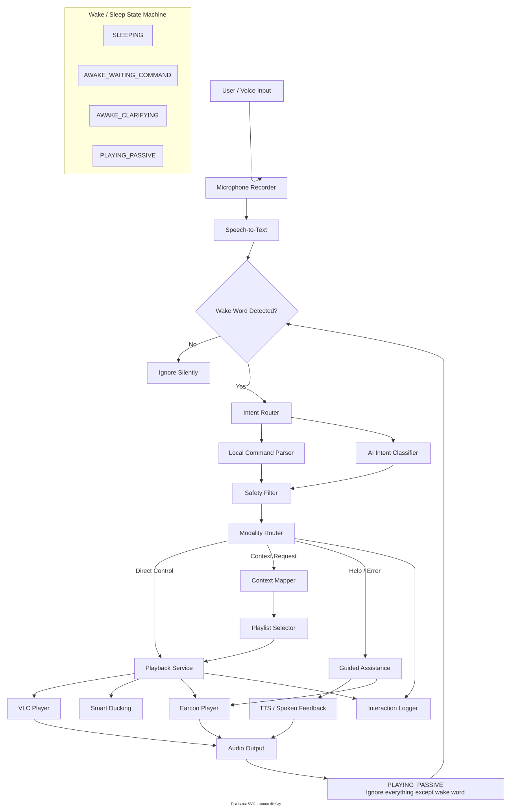

# Echo-Sync

[](https://www.python.org/downloads/)
[](LICENSE)
[](#project-team)

> **An inclusive, screen-free Natural User Interface music player for blind and motor-impaired users.**

Echo-Sync replaces visual menus and touch controls with natural speech, spoken
responses, and short audio cues. Users can issue direct playback commands or
describe their situation -- for example, "I need to focus" -- and Echo-Sync
selects an appropriate local playlist.

The application combines a fast rule-based command path with AI-assisted intent
classification. This keeps common controls predictable while still supporting
flexible, natural requests.


## Project Team

Echo-Sync was developed by **Group 7** for the **Natural User Interfaces (NUI)**
course at HTW Berlin.

- **Project:** Echo-Sync
- **Course:** Natural User Interfaces
- **Institution:** HTW Berlin
- **Team:** Group 7

### Team Roles

| Team Member | Role |
|---|---|
| Ahmed Al-Odaini | Project Coordinator, Documentation & Lo-Fi Prototype Lead |
| Muneer Al-Shetri | Lead Developer & System Architecture Lead |
| Ammar Albahri | Usability Evaluation Lead |
| Bashar Al Abdalla | AI Interaction Lead |
| Magd Alwajih | Project Support & Review |

Although each member had a primary role, the team collaborated on project
planning, design decisions, implementation, testing, and review.


## Project Structure

```text
.
|-- src/echo_sync/
|   |-- ai/                 # Intent classification, context mapping, safety
|   |-- audio/              # Recording, earcons, TTS, silence and ducking
|   |-- config/             # Settings, prompts, and response configuration
|   |-- interaction/        # Dialog flow, onboarding, help, and app state
|   |-- logging_utils/      # CSV interaction logging
|   |-- media/              # Playlist management and VLC/Pygame players
|   |-- speech/             # OpenAI and offline speech-to-text backends
|   |-- app.py              # Main interaction loop
|   `-- main.py             # Command-line entry point
|-- assets/
|   |-- earcons/            # Accessible audio feedback cues
|   `-- music/              # Local music grouped by context
|-- docs/                   # Design, evaluation, testing, and reflection
|-- scripts/                # Test-audio and report helpers
|-- tests/                  # Automated test suite
|-- logs/                   # Interaction logs
|-- NUI architecture.drawio # Editable system architecture
|-- pyproject.toml          # Package metadata and dependencies
`-- README.md
```


## Features

- **Direct voice control:** Play, pause, resume, stop, skip tracks, go back,
  change the volume, and identify the current song.
- **Context-aware music selection:** Maps statements such as "I am tired" or
  "I need energy" to calm, energy, focus, happy, or sad playlists.
- **Rule-based fast path:** Recognizes common commands locally before using the
  AI service, improving speed and reliability.
- **AI intent classification:** Handles more flexible wording with structured,
  music-only intent results.
- **Wake-word interaction:** Uses "Echo" in voice mode and tolerates several
  common transcription variants.
- **Guided assistance:** Provides progressive spoken help after silence,
  unclear input, or explicit help requests.
- **Music-only safety boundary:** Politely rejects unrelated requests and
  redirects the user to supported actions.
- **Eyes-free onboarding:** Introduces the controls and audio cues on first run.
- **Earcon feedback:** Signals listening, success, errors, context selection,
  and help without requiring a screen.
- **Smart ducking:** Lowers playback volume while Echo-Sync processes a request
  and responds, then restores it smoothly.
- **Spoken responses:** Uses available system text-to-speech services and
  degrades safely to terminal output when TTS is unavailable.
- **Player and STT fallbacks:** Falls back from VLC to Pygame and can use
  `faster-whisper` for offline transcription when installed.
- **Interaction logging:** Records transcripts, classified intents, actions,
  and responses in `logs/interaction_logs.csv`.


## How It Works

Each interaction passes through an accessible audio-first pipeline:

1. **Listen** -- play a listening earcon and capture microphone input.
2. **Transcribe** -- convert the recording to text with OpenAI speech-to-text
   or the optional offline Whisper backend.
3. **Activate** -- in voice mode, check for the "Echo" wake word and manage the
   active/passive session state.
4. **Classify** -- match common phrases locally, then use AI for requests that
   need more flexible interpretation.
5. **Route** -- send direct commands to the media controller, map contextual
   requests to a playlist, or provide guided help.
6. **Respond** -- play an earcon, speak the response, and duck music while the
   assistant is talking.
7. **Log** -- save the interaction for testing and evaluation.

### Project Architecture

The following architecture was designed by the Echo-Sync team and shows the
complete voice pipeline, modality routing, playback services, feedback
channels, interaction logging, and wake/sleep state machine.

[](<NUI architecture.drawio>)

The editable diagram is available in
[NUI architecture.drawio](<NUI architecture.drawio>).


## Interaction Modalities

Echo-Sync provides three complementary ways to interact:

| Modality | Purpose | Example |
|---|---|---|
| **Direct Control** | Immediate and predictable playback commands | "Pause" -> pauses the music |
| **Context-Based Request** | Interprets the user's wording and selects a suitable playlist | "I am exhausted" -> calm music |
| **Guided Help** | Supports discovery, silence, unclear input, and off-topic requests | "What can I say?" -> spoken command examples |

Echo-Sync interprets the context expressed in the user's words; it does **not**
perform medical or psychological emotion detection.


## Music Categories

Local tracks are organized into these folders under `assets/music/`:

| Category | Example request |
|---|---|
| `calm` | "Play something relaxing." |
| `energy` | "I need energy." |
| `focus` | "I want to study." |
| `happy` | "Play something cheerful." |
| `sad` | "I feel sad." |
| `fallback` | Used when the requested category has no tracks |

Supported file types are `.mp3`, `.wav`, `.flac`, `.ogg`, `.m4a`, `.aac`, and
`.wma`.


## Installation and Execution

### 1. Prerequisites

- Python **3.11 or newer**
- A working audio output device
- A microphone for voice mode
- An OpenAI API key for OpenAI transcription and AI classification
- VLC media player is recommended; Echo-Sync falls back to Pygame if VLC is
  unavailable

Keyboard demo mode and common rule-based commands can be used without an API
key.

### 2. Set Up the Environment

After cloning the repository, open a terminal in the project folder and create
a local virtual environment:

```bash
python -m venv .venv
```

Activate the virtual environment:

```powershell
# Windows PowerShell
.\.venv\Scripts\Activate.ps1
```

```bash
# macOS/Linux
source .venv/bin/activate
```

Install Echo-Sync and the development tools:

```bash
python -m pip install --upgrade pip
python -m pip install -e ".[dev]"
```

Create a new virtual environment on each computer. Virtual environments are
machine-specific and should not be copied or committed.

For optional offline speech-to-text support:

```bash
python -m pip install -e ".[dev,offline]"
```

### 3. Configure Echo-Sync

Copy the provided environment template:

```powershell
# Windows PowerShell
Copy-Item .env.example .env
```

```bash
# macOS/Linux
cp .env.example .env
```

Then edit `.env` and add your API key:

```ini
OPENAI_API_KEY=your_api_key_here
```

Optional settings use the `ECHO_SYNC_` prefix:

```ini
ECHO_SYNC_STT_MODE=openai
ECHO_SYNC_STT_MODEL=gpt-4o-mini-transcribe
ECHO_SYNC_AI_MODEL=gpt-4o-mini
ECHO_SYNC_PLAYER=vlc
ECHO_SYNC_WAKE_WORD=echo
ECHO_SYNC_DEFAULT_VOLUME=80
ECHO_SYNC_DUCKING_VOLUME=30
ECHO_SYNC_SILENCE_TIMEOUT=10
```

To use local transcription, install the `offline` dependency group and set:

```ini
ECHO_SYNC_STT_MODE=offline
```

### 4. Add Music

Place audio files in the matching category folders:

```text
assets/music/
|-- calm/
|-- energy/
|-- focus/
|-- happy/
|-- sad/
`-- fallback/
```

### 5. Run Echo-Sync

Start voice mode:

```bash
python -m echo_sync.main
```

Start keyboard demo mode:

```bash
python -m echo_sync.main --demo-keyboard
```

Useful options:

```bash
python -m echo_sync.main --verbose
python -m echo_sync.main --reset-setup
python -m echo_sync.main --skip-setup
```

In keyboard mode, type `quit`, `exit`, or `q` to close the application.

### 6. Run the Tests

```bash
python -m pytest tests/ -v
```

To include coverage:

```bash
python -m pytest tests/ --cov=echo_sync --cov-report=term-missing
```


## Example Commands

```text
"Echo, play music."
"Echo, pause."
"Echo, continue."
"Echo, next song."
"Echo, make it louder."
"Echo, what song is this?"
"Echo, I am tired."
"Echo, I need to focus."
"Echo, what can I say?"
```


## Technology Stack

| Component | Technology |
|---|---|
| Language and packaging | Python 3.11+, setuptools |
| AI classification | OpenAI `gpt-4o-mini` |
| Speech-to-text | OpenAI `gpt-4o-mini-transcribe` |
| Optional offline STT | `faster-whisper` |
| Audio recording | `sounddevice`, `soundfile` |
| Music playback | `python-vlc`, `pygame-ce` |
| Configuration | Pydantic, `pydantic-settings`, `python-dotenv` |
| Terminal interface | Rich |
| Testing | pytest, pytest-cov |


## Documentation

The `docs/` directory contains the supporting project work:

- [Project summary](docs/01_project_summary.md)
- [Voice control vs. AI assistant](docs/02_voice_control_vs_ai_assistant.md)
- [Interaction modalities](docs/03_modalities.md)
- [System architecture](docs/07_system_diagram.md)
- [User journey](docs/08_user_journey.md)
- [Interaction flow](docs/09_interaction_flow.md)
- [Heuristic evaluation](docs/10_heuristic_evaluation.md)
- [Lo-fi testing](docs/11_lofi_testing.md)
- [Test plan](docs/12_test_plan.md)
- [Final reflection](docs/13_final_reflection.md)


## Roadmap

- [x] Direct music-control commands
- [x] Context-to-playlist mapping
- [x] Guided help and off-topic handling
- [x] Earcons, spoken feedback, and smart ducking
- [x] Wake-word flow and eyes-free onboarding
- [x] VLC/Pygame playback fallback
- [x] Automated tests and interaction logging
- [ ] Streaming-service integration
- [ ] Fully local AI classification
- [ ] Multilingual interaction
- [ ] Remembered user preferences and multiple profiles
- [ ] Broader testing with blind and motor-impaired users


## Known Limitations

- Music is loaded from local files; streaming services are not yet integrated.
- AI classification and the default STT backend require an internet connection
  and an OpenAI API key.
- The interaction language is currently English.
- Context selection is limited to predefined playlist categories.
- Offline STT requires the optional `faster-whisper` dependency and downloads a
  local model on first use.
- Text-to-speech quality depends on the operating system and available voices.


## License

Echo-Sync source code and original project assets are released under the
[MIT License](LICENSE). The included Jamendo demonstration tracks retain their
Creative Commons licenses; see [ASSET_LICENSES.md](ASSET_LICENSES.md) for
attribution and reuse conditions.

Copyright (c) 2026 Group 7, HTW Berlin.
